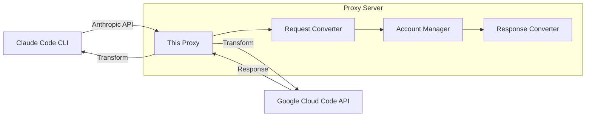

# Antigravity Claude Proxy

A proxy server exposing an **Anthropic-compatible API** backed by **Google Cloud Code** (Antigravity). Use Claude and Gemini models with Claude Code CLI.

## Prerequisites

- **Node.js** 18 or later
- **Antigravity** installed (for single-account mode) OR Google account(s) for multi-account mode

## Installation

### Option 1: npx (No Install)

```bash
npx ag-cl start
```

### Option 2: Global Install

```bash
npm install -g ag-cl
ag-cl start
```

### Option 3: Clone Repository

```bash
git clone https://github.com/NikkeTryHard/ag-cl.git
cd ag-cl
npm install
npm start
```

## Quick Start

### 1. Add Account(s)

**Option A: Use Antigravity (Single Account)**

If you have Antigravity installed and logged in, the proxy automatically extracts your token. No additional setup needed.

**Option B: Add Google Accounts via OAuth (Multi-Account)**

```bash
# Desktop/laptop (opens browser)
ag-cl accounts add

# Headless server (Docker, SSH, no desktop)
ag-cl accounts add --no-browser
```

The `--no-browser` option displays an OAuth URL you can open on another device. After signing in, paste the redirect URL or authorization code back into the terminal.

### 2. Configure Claude Code

Create or edit `~/.claude/settings.json`:

**For Claude models:**

```json
{
  "env": {
    "ANTHROPIC_AUTH_TOKEN": "test",
    "ANTHROPIC_BASE_URL": "http://localhost:8080",
    "ANTHROPIC_MODEL": "claude-opus-4-5-thinking",
    "ANTHROPIC_DEFAULT_OPUS_MODEL": "claude-opus-4-5-thinking",
    "ANTHROPIC_DEFAULT_SONNET_MODEL": "claude-sonnet-4-5-thinking",
    "ANTHROPIC_DEFAULT_HAIKU_MODEL": "claude-sonnet-4-5",
    "CLAUDE_CODE_SUBAGENT_MODEL": "claude-sonnet-4-5-thinking"
  }
}
```

**For Gemini models:**

```json
{
  "env": {
    "ANTHROPIC_AUTH_TOKEN": "test",
    "ANTHROPIC_BASE_URL": "http://localhost:8080",
    "ANTHROPIC_MODEL": "gemini-3-pro-high",
    "ANTHROPIC_DEFAULT_OPUS_MODEL": "gemini-3-pro-high",
    "ANTHROPIC_DEFAULT_SONNET_MODEL": "gemini-3-flash",
    "ANTHROPIC_DEFAULT_HAIKU_MODEL": "gemini-2.5-flash-lite",
    "CLAUDE_CODE_SUBAGENT_MODEL": "gemini-3-flash"
  }
}
```

**Settings file location:**

- macOS/Linux: `~/.claude/settings.json`
- Windows: `%USERPROFILE%\.claude\settings.json`

### 3. Set Environment Variables (Optional)

**macOS/Linux (zsh):**

```bash
echo 'export ANTHROPIC_BASE_URL="http://localhost:8080"' >> ~/.zshrc
echo 'export ANTHROPIC_API_KEY="test"' >> ~/.zshrc
source ~/.zshrc
```

**Windows (PowerShell):**

```powershell
Add-Content $PROFILE "`n`$env:ANTHROPIC_BASE_URL = 'http://localhost:8080'"
Add-Content $PROFILE "`$env:ANTHROPIC_API_KEY = 'test'"
. $PROFILE
```

### 4. Start the Proxy and Run Claude Code

```bash
# Start proxy
ag-cl start

# In another terminal
claude
```

If Claude Code asks you to select a login method, add `"hasCompletedOnboarding": true` to `~/.claude.json`, then restart your terminal.

## Architecture



### Request Flow

1. **Receive** Anthropic Messages API request
2. **Authenticate** using OAuth tokens from added accounts
3. **Transform** request to Google Generative AI format
4. **Send** to Cloud Code API (`cloudcode-pa.googleapis.com`)
5. **Transform** response back to Anthropic format
6. **Return** with full thinking/streaming support

## Models

### Claude Models

| Model ID                     | Description                              |
| ---------------------------- | ---------------------------------------- |
| `claude-sonnet-4-5-thinking` | Claude Sonnet 4.5 with extended thinking |
| `claude-opus-4-5-thinking`   | Claude Opus 4.5 with extended thinking   |
| `claude-sonnet-4-5`          | Claude Sonnet 4.5 (no thinking)          |

### Gemini Models

| Model ID            | Description                  |
| ------------------- | ---------------------------- |
| `gemini-3-flash`    | Gemini 3 Flash with thinking |
| `gemini-3-pro-low`  | Gemini 3 Pro Low             |
| `gemini-3-pro-high` | Gemini 3 Pro High            |

Gemini models include full thinking support with `thoughtSignature` handling for multi-turn conversations.

## CLI Reference

| Command                        | Description                               |
| ------------------------------ | ----------------------------------------- |
| `start`                        | Start proxy server                        |
| `start --port 3000`            | Custom port (default: 8080)               |
| `start --fallback`             | Enable model fallback on quota exhaustion |
| `start --debug`                | Verbose logging                           |
| `init`                         | Interactive setup wizard                  |
| `accounts add`                 | Add account via OAuth                     |
| `accounts add --no-browser`    | Headless OAuth (manual URL)               |
| `accounts add --refresh-token` | Use refresh token directly                |
| `accounts list`                | List accounts with capacity info          |
| `accounts list --json`         | Output capacity as JSON (for scripting)   |
| `accounts verify`              | Verify account tokens                     |
| `accounts remove`              | Remove accounts interactively             |
| `accounts clear`               | Remove all accounts                       |

### Logging Options

```bash
ag-cl start \
  --log-level debug \    # silent|error|warn|info|debug|trace
  --log-file proxy.log \ # Log to file
  --json-logs \          # JSON output for parsing
  --silent               # Suppress output except errors
```

## Multi-Account Load Balancing

When multiple accounts are added:

- **Sticky sessions** - Stays on same account for prompt cache hits
- **Smart failover** - Short rate limits (<=2min): wait. Longer: switch accounts
- **Auto-recovery** - Rate-limited accounts rejoin after reset
- **Invalid detection** - Bad tokens are marked and skipped
- **Prompt caching** - Stable session IDs enable cache hits across turns

Check status:

```bash
curl "http://localhost:8080/account-limits?format=table"
```

### Account Capacity Display

The `accounts list` command shows detailed capacity information:

```
[1] user@example.com
    Tier: PRO

    Claude Pool
    -----------
    claude-sonnet-4-5-thinking  [=========>          ] 45%  Resets: 2h 15m
    Burn Rate: 15%/hr | Exhausted in: ~3h

    Gemini Pool
    -----------
    gemini-3-pro-high           [=================>  ] 85%  Resets: 4h 30m
    Burn Rate: 5%/hr | Exhausted in: ~12h
```

Features:

- **Tier detection** - Shows FREE, PRO, or ULTRA tier
- **Quota per model family** - Separate Claude and Gemini pools
- **Progress bars** - Color-coded (green ≥50%, yellow 20-49%, red <20%)
- **Reset times** - When quota resets (from API)
- **Burn rate** - Consumption rate and time to exhaustion
- **JSON output** - Use `--json` for scripting

## API Endpoints

| Endpoint          | Method | Description               |
| ----------------- | ------ | ------------------------- |
| `/v1/messages`    | POST   | Anthropic Messages API    |
| `/v1/models`      | GET    | List available models     |
| `/health`         | GET    | Health check              |
| `/account-limits` | GET    | Account status and quotas |
| `/refresh-token`  | POST   | Force token refresh       |

## Troubleshooting

### "Could not extract token"

If using single-account mode with Antigravity:

1. Make sure Antigravity app is installed and running
2. Ensure you're logged in to Antigravity

Or add accounts via OAuth: `ag-cl accounts add`

### 401 Authentication Errors

```bash
curl -X POST http://localhost:8080/refresh-token
```

Or re-authenticate: `ag-cl accounts`

### Rate Limiting (429)

With multiple accounts, the proxy auto-switches. Single account must wait for reset.

### Account Shows as "Invalid"

Re-authenticate the account:

```bash
ag-cl accounts
# Choose "Re-authenticate" for the invalid account
```

## Development

```bash
# Clone and install
git clone https://github.com/NikkeTryHard/ag-cl.git
cd ag-cl
npm install

# Development
npm run dev              # File watching
npm run typecheck        # Type checking
npm run lint             # ESLint

# Testing
npm test                 # Unit tests
npm run test:coverage    # With coverage
npm run test:bench       # Benchmarks
npm run test:integration # Integration (server must be running)
```

## How This Fork Differs

This is a TypeScript rewrite of the [original proxy](https://github.com/badri-s2001/antigravity-claude-proxy) with significant improvements:

### Code Quality

| Aspect      | Original   | This Fork                                                                |
| ----------- | ---------- | ------------------------------------------------------------------------ |
| Language    | JavaScript | TypeScript                                                               |
| Tests       | None       | Comprehensive test suite                                                 |
| Test Types  | -          | Unit, fuzz, contract, snapshot, golden file, chaos, load, security, type |
| Type Safety | None       | Full static typing                                                       |

### Developer Experience

| Feature | Original       | This Fork                   |
| ------- | -------------- | --------------------------- |
| CLI     | Basic argparse | Commander + @clack/prompts  |
| Logging | Console.log    | Pino structured logging     |
| UI      | Plain text     | Colors, spinners, tables    |
| Setup   | Manual         | Interactive wizard (`init`) |

### Reliability

- **Fuzz testing** - Property-based tests for edge cases
- **Contract tests** - API schema validation
- **Benchmark suite** - Performance regression detection
- **Pre-commit hooks** - Gitleaks secret scanning

### Core Functionality Preserved

All original features remain fully compatible:

- Anthropic Messages API format
- Streaming with SSE
- Extended thinking blocks
- Multi-account rotation
- Rate limit handling
- OAuth authentication
- Model fallback

## Safety and Risk Notice

### Intended Use

- Personal/internal development only
- Respect internal quotas and data handling policies
- Not for production services or bypassing intended limits

### Warning

By using this software, you acknowledge:

- **Terms of Service risk**: This approach may violate the Terms of Service of AI model providers (Anthropic, Google, etc.). You are solely responsible for ensuring compliance.
- **Account risk**: Providers may detect this usage pattern and take action including suspension or permanent ban.
- **No guarantees**: Providers may change APIs, authentication, or policies at any time without notice.
- **Assumption of risk**: You assume all legal, financial, and technical risks. The authors bear no responsibility for any consequences.

## Legal

Not affiliated with Google or Anthropic. This is an independent open-source project.

- "Antigravity", "Gemini", "Google Cloud", and "Google" are trademarks of Google LLC.
- "Claude" and "Anthropic" are trademarks of Anthropic PBC.

Software is provided "as is", without warranty. See [LICENSE](LICENSE) for details.

## Credits

This project is based on work from:

- [opencode-antigravity-auth](https://github.com/NoeFabris/opencode-antigravity-auth) - Antigravity OAuth plugin for OpenCode
- [claude-code-proxy](https://github.com/1rgs/claude-code-proxy) - Anthropic API proxy using LiteLLM
- [antigravity-claude-proxy](https://github.com/badri-s2001/antigravity-claude-proxy) - Original JavaScript implementation by badri-s2001

---

MIT License
