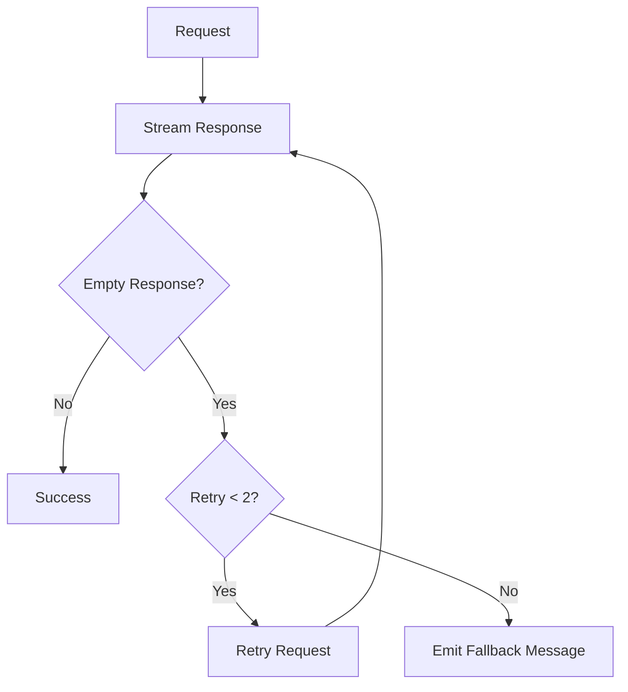

# Upstream Investigation Report

> Generated: 2026-01-07
> Upstream: [badri-s2001/antigravity-claude-proxy](https://github.com/badri-s2001/antigravity-claude-proxy)
> Stars: 1,123 | Forks: 136 | Last Updated: 2026-01-08

## Executive Summary

The upstream repository is actively maintained with strong community engagement. There are **3 open PRs** and **4 open issues** as of this report. Key themes include:

- Web dashboard/UI features (multiple implementations)
- Empty response retry mechanism
- Quota reset triggers
- Context window reporting for Gemini models
- Sticky account configuration

---

## Open Pull Requests

### High Priority (Features)

| PR                                                                     | Title                                             | Author         | Created    | Status |
| ---------------------------------------------------------------------- | ------------------------------------------------- | -------------- | ---------- | ------ |
| [#64](https://github.com/badri-s2001/antigravity-claude-proxy/pull/64) | fix: add retry mechanism for empty API responses  | @BrunoMarc     | 2026-01-07 | OPEN   |
| [#47](https://github.com/badri-s2001/antigravity-claude-proxy/pull/47) | feat: Add Web UI for account and quota management | @Wha1eChai     | 2026-01-04 | OPEN   |
| [#44](https://github.com/badri-s2001/antigravity-claude-proxy/pull/44) | feat: Add quota reset trigger system              | @shivangtanwar | 2026-01-03 | OPEN   |

### PR #64: Empty Response Retry Mechanism

**Problem**: When Claude Code sends requests with large `thinking_budget` values (e.g., 31999), the model may spend all tokens on "thinking" and return empty responses. This causes `[No response received from API]` errors, making Claude Code stop mid-conversation.

**Solution**: Implements automatic retry (up to 2 times) before emitting fallback message.



**Testing Results** (6+ hours production):
| Metric | Before | After |
|--------|--------|-------|
| Empty response errors | 49 | 2 |
| Recovery rate | 0% | 88% |
| Total requests processed | - | 1,884 |

**Recommendation**: **HIGH PRIORITY** - This addresses a critical UX issue.

---

### PR #47: Web UI for Account and Quota Management

**Features**:

- Dashboard with real-time model quota visualization (Chart.js)
- Account management (OAuth add/enable/disable/refresh/remove)
- Live server log streaming via SSE with search and filtering
- Settings with 4 tabs: Interface, Claude CLI, Models, Server Info
- i18n support (EN/zh_CN)
- Optional password protection (`WEBUI_PASSWORD` env var)
- Minimal integration (only 5 lines added to server.js)

**Technical Stack**: Alpine.js + TailwindCSS + DaisyUI

**New API Endpoints**:

- `GET/POST /api/config` - Server configuration
- `GET/POST /api/claude/config` - Claude CLI configuration
- `POST /api/models/config` - Model alias/hidden settings
- `GET /api/accounts` - Account list with status
- `POST /api/accounts/:email/toggle` - Enable/disable account
- `POST /api/accounts/:email/refresh` - Refresh account token
- `DELETE /api/accounts/:email` - Remove account
- `GET /api/logs` - Log history
- `GET /api/logs/stream` - Live log streaming (SSE)
- `GET /api/auth/url` - OAuth URL generation
- `GET /oauth/callback` - OAuth callback handler

**Recommendation**: **MEDIUM PRIORITY** - Nice-to-have but adds complexity. Consider feature flags.

---

### PR #44: Quota Reset Trigger System

**Features**:

- Trigger 5-hour quota reset timer for all accounts via:
  - API endpoint: `POST /trigger-reset`
  - CLI command: `antigravity-claude-proxy trigger-reset`
  - Server startup flag: `--trigger-reset` or `TRIGGER_RESET=true`
- Enhanced `/account-limits` showing 3 separate quota reset times per quota group

**Quota Groups**:
| Group | Models |
|-------|--------|
| Claude | claude-sonnet-4-5, claude-opus-4-5-thinking, gpt-oss-120b |
| Gemini Pro | gemini-3-pro-high, gemini-3-pro-low |
| Gemini Flash | gemini-3-flash |

**Recommendation**: **LOW PRIORITY** - Edge case feature.

---

## Open Issues

| Issue                                                                    | Title                                            | Author        | Created    | Type            |
| ------------------------------------------------------------------------ | ------------------------------------------------ | ------------- | ---------- | --------------- |
| [#61](https://github.com/badri-s2001/antigravity-claude-proxy/issues/61) | Fix: Add retry mechanism for empty API responses | @BrunoMarc    | 2026-01-06 | Bug/Enhancement |
| [#57](https://github.com/badri-s2001/antigravity-claude-proxy/issues/57) | FEATURE: Let us disable sticky accounts          | @Blueemi      | 2026-01-05 | Feature Request |
| [#53](https://github.com/badri-s2001/antigravity-claude-proxy/issues/53) | Report correct context_length for Gemini models  | @BrunoMarc    | 2026-01-04 | Feature Request |
| [#39](https://github.com/badri-s2001/antigravity-claude-proxy/issues/39) | Dashboard interface                              | @chuanghiduoc | 2026-01-03 | Feature Request |
| [#27](https://github.com/badri-s2001/antigravity-claude-proxy/issues/27) | WebSearch tool - 0 results                       | @Anderson-RC  | 2025-12-31 | Bug/Limitation  |

### Issue #61: Empty API Response Retry (Same as PR #64)

Already addressed by PR #64 above.

### Issue #57: Disable Sticky Accounts

**Request**: Option to disable sticky account behavior for reduced rate limits.

**Context**: Sticky accounts keep requests on the same account to maintain conversation context, but this can lead to faster rate limiting on individual accounts vs round-robin distribution.

**Potential Implementation**:

```bash
npm start -- --no-sticky          # CLI flag
DISABLE_STICKY=true npm start     # Environment variable
```

**Recommendation**: **MEDIUM PRIORITY** - Valid use case for high-throughput scenarios.

---

### Issue #53: Report Correct context_length for Gemini Models

**Problem**: Claude Code's auto-compaction triggers frequently because it assumes 200K context window (Claude default). Gemini models support up to 1M tokens.

**Current Behavior**:

```json
{
  "id": "gemini-3-pro-high",
  "object": "model",
  "owned_by": "anthropic"
}
```

**Proposed Solution**:

```json
{
  "id": "gemini-3-pro-high",
  "object": "model",
  "owned_by": "anthropic",
  "context_length": 1000000
}
```

**Affected Models**:
| Model | Suggested context_length |
|-------|-------------------------|
| gemini-3-flash | 1,000,000 |
| gemini-3-pro-low | 1,000,000 |
| gemini-3-pro-high | 1,000,000 |
| gemini-2.5-pro | 1,000,000 |
| gemini-2.5-flash | 1,000,000 |

**Recommendation**: **HIGH PRIORITY** - Quick win, significant UX improvement.

---

### Issue #39: Dashboard Interface

**Request**: Visual dashboard for monitoring (referenced [cliProxyAPI-Dashboard](https://github.com/0xAstroAlpha/cliProxyAPI-Dashboard) - 74 stars).

**Status**: Multiple implementations attempted:

- PR #47 (WebUI by @Wha1eChai) - OPEN, most comprehensive
- PR #46 (Dashboard by @SlasshyOverhere) - CLOSED
- PR #43 (Dashboard by @udayvarmora07) - CLOSED

**Recommendation**: Consider merging PR #47 or creating a simpler standalone solution.

---

### Issue #27: WebSearch Tool Returns 0 Results

**Status**: OPEN since 2025-12-31

**Limitation**: WebSearch tool always fails. If it uses Anthropic's APIs directly, it would make sense it fails through the proxy.

**Recommendation**: Document as known limitation or investigate workaround (e.g., proxy to Brave Search).

---

## Recently Merged PRs (Notable)

| PR                                                                     | Title                                                        | Merged     | Impact           |
| ---------------------------------------------------------------------- | ------------------------------------------------------------ | ---------- | ---------------- |
| [#55](https://github.com/badri-s2001/antigravity-claude-proxy/pull/55) | fix(oauth): add UTF-8 encoding to callback HTML              | 2026-01-06 | Bug fix          |
| [#54](https://github.com/badri-s2001/antigravity-claude-proxy/pull/54) | feat: Auto native module rebuild on Node.js version mismatch | 2026-01-06 | DX improvement   |
| [#50](https://github.com/badri-s2001/antigravity-claude-proxy/pull/50) | feat: add --no-browser OAuth mode for headless servers       | 2026-01-04 | Feature          |
| [#41](https://github.com/badri-s2001/antigravity-claude-proxy/pull/41) | Feature/model fallback                                       | 2026-01-03 | Feature          |
| [#37](https://github.com/badri-s2001/antigravity-claude-proxy/pull/37) | Selective fixes: Model-specific rate limits & robustness     | 2026-01-03 | Bug fix          |
| [#29](https://github.com/badri-s2001/antigravity-claude-proxy/pull/29) | Improve logging, rate limiting, and error handling           | 2026-01-01 | Quality          |
| [#13](https://github.com/badri-s2001/antigravity-claude-proxy/pull/13) | Add count_tokens stub                                        | 2025-12-29 | Compatibility    |
| [#1](https://github.com/badri-s2001/antigravity-claude-proxy/pull/1)   | Add Linux support with cross-platform detection              | 2025-12-25 | Platform support |

---

## Closed Issues (Common Themes)

### Authentication & Setup

| Issue | Title                             | Resolution                      |
| ----- | --------------------------------- | ------------------------------- |
| #48   | 401 UNAUTHENTICATED errors        | Need Gemini Code Assist enabled |
| #23   | Token extraction failed (Windows) | sqlite3 not in PATH             |
| #19   | 404 error + Auth conflict         | Need to /logout first           |
| #9    | Missing .credentials.json step    | Added to README                 |

### API Errors

| Issue | Title                              | Resolution                     |
| ----- | ---------------------------------- | ------------------------------ |
| #52   | thinking.signature: Field required | Official Claude API issue      |
| #51   | 400 cache_control errors           | Fixed in proxy                 |
| #33   | 404 NOT_FOUND on all models        | Gemini Code Assist not enabled |
| #6    | Protobuf validation errors         | Fixed by schema normalizer     |
| #5    | 500 Unknown Error                  | Transient server issues        |

### Cross-Model Issues

| Issue | Title                                       | Resolution                                 |
| ----- | ------------------------------------------- | ------------------------------------------ |
| #18   | Corrupted thought signature on model switch | Fixed by stripping incompatible signatures |

---

## Related Projects & Features

### External Dashboards

| Project                                                                        | Stars | Features                       |
| ------------------------------------------------------------------------------ | ----- | ------------------------------ |
| [cliProxyAPI-Dashboard](https://github.com/0xAstroAlpha/cliProxyAPI-Dashboard) | 74    | Visual dashboard for CLI proxy |

### Forks with Extended Features

| Fork                                                                                        | Branch        | Features                            |
| ------------------------------------------------------------------------------------------- | ------------- | ----------------------------------- |
| [Wha1eChai/antigravity-claude-proxy](https://github.com/Wha1eChai/antigravity-claude-proxy) | feature/webui | Full Web UI implementation          |
| [johnneerdael/antigravity-gateway](https://github.com/johnneerdael/antigravity-gateway)     | main          | Docker + OpenAI-compatible endpoint |

### Community Contributions (Closed PRs Worth Reviewing)

| PR  | Title                                    | Author        | Notes                      |
| --- | ---------------------------------------- | ------------- | -------------------------- |
| #56 | TypeScript migration, Docker support     | @NikkeTryHard | Different TS approach      |
| #35 | Network error handling, OpenAI endpoints | @M2noa        | OpenAI compat was excluded |
| #30 | Schema flattening for Protobuf           | @Sahaj33-op   | Alternative approach       |

---

## Feature Gap Analysis

### Features We Have That Upstream Lacks

| Feature                   | Our Implementation                | Status   |
| ------------------------- | --------------------------------- | -------- |
| TypeScript codebase       | Full TypeScript                   | Complete |
| Comprehensive test suite  | Unit, fuzz, contract, chaos, etc. | Complete |
| SQLite quota snapshots    | quota-storage.ts                  | Complete |
| Burn rate calculation     | burn-rate.ts                      | Complete |
| Colored capacity renderer | capacity-renderer.ts              | Complete |

### Features Upstream Has That We Should Consider

| Feature                    | Upstream Location | Priority | Notes              |
| -------------------------- | ----------------- | -------- | ------------------ |
| Native module auto-rebuild | PR #54            | LOW      | Good for npx users |
| --no-browser OAuth         | PR #50            | MEDIUM   | Already have this  |
| Empty response retry       | PR #64            | HIGH     | Should implement   |
| Gemini context_length      | Issue #53         | HIGH     | Quick win          |
| Web UI                     | PR #47            | LOW      | Consider later     |
| Disable sticky accounts    | Issue #57         | MEDIUM   | Consider flag      |
| Quota reset trigger        | PR #44            | LOW      | Edge case          |

---

## Recommendations

### Immediate Actions (This Week)

1. **Implement Empty Response Retry** (from PR #64)
   - Critical for production stability
   - 88% recovery rate improvement
   - Relatively simple implementation

2. **Add Gemini context_length to /v1/models** (from Issue #53)
   - Quick 15-minute fix
   - Prevents unnecessary auto-compaction
   - Significant UX improvement

### Short-Term (This Month)

3. **Add --no-sticky flag** (from Issue #57)
   - Configuration flexibility
   - Useful for high-throughput scenarios

4. **Document WebSearch limitation** (Issue #27)
   - Known limitation in README
   - Potential future MCP integration

### Medium-Term (Future)

5. **Consider lightweight dashboard**
   - Simpler than PR #47
   - Just quota visualization
   - Optional feature flag

6. **Monitor PR #15 (Map model/project 404s)**
   - Better error messages
   - Currently OPEN

---

## Sync Status

```
Current upstream bookmark: (run npm run upstream:status to check)
```

**Commands**:

```bash
npm run upstream:status     # Show bookmark position vs upstream HEAD
npm run upstream:log        # Show new commits since last bookmark
npm run upstream:diff       # File-level summary of changes
npm run upstream:mark       # Update bookmark after review
```
