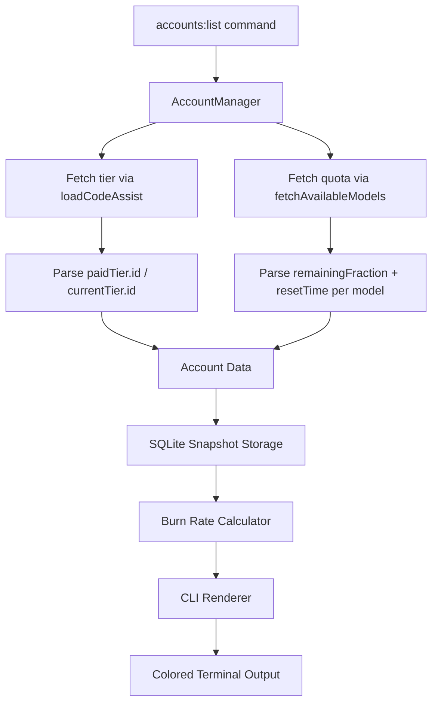

# Account Capacity Feature Design

## Overview

Enhance the `accounts:list` CLI command to display comprehensive account capacity information with beautiful colored output, including tier detection, quota per model family, reset times, and burn rate predictions.

## Key Findings from Antigravity-Manager Investigation

### 1. Tier Detection

- **Endpoint**: `POST https://cloudcode-pa.googleapis.com/v1internal:loadCodeAssist`
- **Payload**: `{"metadata": {"ideType": "ANTIGRAVITY"}}`
- **Response fields**: `paidTier.id` or `currentTier.id`
- **Values**: `FREE`, `PRO`, `ULTRA`
- **Cost**: Does NOT consume quota (metadata endpoint)

### 2. Quota Information

- **Endpoint**: `POST https://cloudcode-pa.googleapis.com/v1internal:fetchAvailableModels`
- **Response per model**:
  - `remainingFraction`: 0.0-1.0 (multiply by 100 for percentage)
  - `resetTime`: ISO 8601 timestamp string (e.g., `2026-01-07T15:30:00Z`)

### 3. Reset Time Behavior

The reset time is **per-model, provided by the API** - not hardcoded per tier. Each model in the response has its own `resetTime` field. This means:

- Reset windows may vary by model family (Claude vs Gemini)
- The API dynamically calculates when quota resets
- No need to hardcode 5h/weekly assumptions

### 4. Model Families (Quota Pools)

From Antigravity-Manager, relevant models include:

- **Claude pool**: `claude-sonnet-4-5-thinking` and similar Claude variants
- **Gemini pool**: `gemini-3-pro-high`, `gemini-3-flash`, `gemini-3-pro-image`

## Architecture



## Data Structures

### Account Capacity Info

```typescript
interface AccountCapacity {
  email: string;
  tier: "FREE" | "PRO" | "ULTRA";
  claudePool: ModelPoolInfo;
  geminiPool: ModelPoolInfo;
  lastUpdated: number;
}

interface ModelPoolInfo {
  models: ModelQuotaInfo[];
  aggregatedPercentage: number; // Sum across models (capped at 100 per model)
  earliestReset: string; // ISO timestamp of soonest reset
}

interface ModelQuotaInfo {
  name: string;
  percentage: number; // 0-100
  resetTime: string; // ISO timestamp
}
```

### SQLite Schema for Burn Rate

```sql
CREATE TABLE IF NOT EXISTS quota_snapshots (
  id INTEGER PRIMARY KEY AUTOINCREMENT,
  account_id TEXT NOT NULL,
  model_family TEXT NOT NULL,  -- 'claude' or 'gemini'
  percentage INTEGER NOT NULL,
  recorded_at INTEGER NOT NULL, -- Unix timestamp
  UNIQUE(account_id, model_family, recorded_at)
);

CREATE INDEX idx_snapshots_account_time ON quota_snapshots(account_id, recorded_at DESC);
```

## Burn Rate Calculation

### Algorithm

1. Query last N snapshots within the reset window
2. Calculate delta: `(oldest_percentage - current_percentage)`
3. Calculate time delta: `(now - oldest_recorded_at)`
4. Burn rate: `delta / time_delta` (percentage per hour)
5. Time to exhaustion: `current_percentage / burn_rate`

### Edge Cases

- **No history**: Display "Calculating..." (need at least 2 data points)
- **Zero burn rate**: Display "Stable" (no usage detected)
- **Already exhausted (0%)**: Display "Exhausted - resets in X"
- **Negative burn rate**: Display "Recovering" (quota increased, likely reset occurred)

## CLI Output Design

```
Account Capacity Overview
=========================

[1] user@example.com
    Tier: PRO (gradient blue badge)

    Claude Pool
    -----------
    claude-sonnet-4-5-thinking  [=========>          ] 45%  Resets: 2h 15m
    Burn Rate: 15%/hr | Exhausted in: ~3h

    Gemini Pool
    -----------
    gemini-3-pro-high           [=================>  ] 85%  Resets: 4h 30m
    gemini-3-flash              [===================] 100% Resets: 4h 30m
    gemini-3-pro-image          [============>       ] 60%  Resets: 4h 30m
    Burn Rate: 5%/hr | Exhausted in: ~12h

[2] another@example.com
    Tier: FREE (gray badge)

    Claude Pool
    -----------
    claude-sonnet-4-5-thinking  [=>                  ] 10%  Resets: 5d 12h
    Burn Rate: 2%/hr | Exhausted in: ~5h (BEFORE RESET)

    ... (similar for Gemini)

=========================
Summary
=========================
Total Accounts: 5 (2 PRO, 2 FREE, 1 ULTRA)
Combined Claude Capacity: 245% (sum of all)
Combined Gemini Capacity: 380% (sum of all)
Soonest Reset: 2h 15m (user@example.com Claude)
```

### Color Coding

| Element      | Condition             | Color                |
| ------------ | --------------------- | -------------------- |
| Tier Badge   | ULTRA                 | Purple/Pink gradient |
| Tier Badge   | PRO                   | Blue/Indigo gradient |
| Tier Badge   | FREE                  | Gray                 |
| Progress Bar | >= 50%                | Green                |
| Progress Bar | 20-49%                | Yellow/Amber         |
| Progress Bar | < 20%                 | Red                  |
| Reset Time   | < 1h                  | Green (reset soon)   |
| Reset Time   | 1-6h                  | Amber                |
| Reset Time   | > 6h                  | Gray                 |
| Burn Warning | Exhausts before reset | Red + "BEFORE RESET" |

## Implementation Plan

### Phase 1: Core Infrastructure

1. Add `better-sqlite3` dependency for SQLite storage
2. Create quota snapshot table schema
3. Implement tier detection using `loadCodeAssist` endpoint
4. Extend quota fetching to store snapshots

### Phase 2: Burn Rate Calculator

1. Implement snapshot storage on each quota fetch
2. Create burn rate calculation module
3. Handle edge cases (no data, stable, recovering)

### Phase 3: CLI Renderer

1. Add `chalk` for colors (already likely in deps)
2. Create progress bar renderer
3. Create tier badge renderer
4. Implement full capacity table renderer

### Phase 4: Integration

1. Update `accounts:list` command to use new renderer
2. Add `--capacity` flag (or make it default)
3. Add `--json` flag for machine-readable output

## API Reference

### loadCodeAssist Request

```bash
curl -X POST 'https://cloudcode-pa.googleapis.com/v1internal:loadCodeAssist' \
  -H 'Authorization: Bearer <access_token>' \
  -H 'Content-Type: application/json' \
  -d '{"metadata": {"ideType": "ANTIGRAVITY"}}'
```

### loadCodeAssist Response

```json
{
  "cloudaicompanionProject": "bamboo-precept-xxxxx",
  "paidTier": {
    "id": "PRO",
    "quotaTier": "...",
    "name": "Pro",
    "slug": "pro"
  },
  "currentTier": {
    "id": "FREE",
    ...
  }
}
```

### fetchAvailableModels Response

```json
{
  "models": {
    "claude-sonnet-4-5-thinking": {
      "quotaInfo": {
        "remainingFraction": 0.45,
        "resetTime": "2026-01-07T17:30:00Z"
      }
    },
    "gemini-3-pro-high": {
      "quotaInfo": {
        "remainingFraction": 0.85,
        "resetTime": "2026-01-07T19:45:00Z"
      }
    }
  }
}
```

## Dependencies

```json
{
  "better-sqlite3": "^11.0.0",
  "chalk": "^5.3.0"
}
```

Note: `chalk` may need ESM handling or use `chalk@4` for CommonJS compatibility.

## Success Criteria

1. Tier detection works for FREE/PRO/ULTRA accounts
2. Quota percentages match what Antigravity-Manager shows
3. Reset times are accurate (from API, not hardcoded)
4. Burn rate predictions are reasonable (within 10% accuracy after 3+ data points)
5. CLI output is visually appealing and informative
6. Performance: Full capacity check for 10 accounts < 10 seconds
