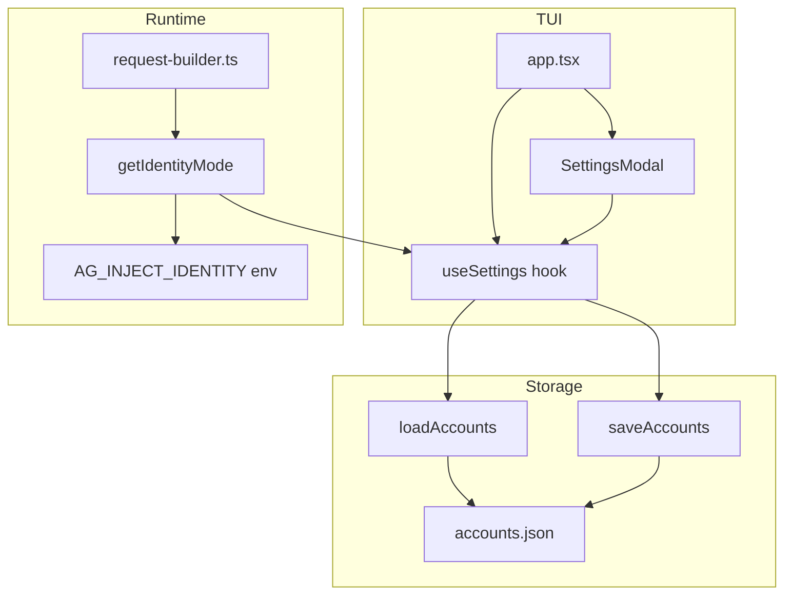

# TUI Settings Feature Design

## Overview

Add a settings modal to the TUI for configuring identity injection mode and server defaults.

## Settings

| Setting           | Type                                                            | Default  | Description                                |
| ----------------- | --------------------------------------------------------------- | -------- | ------------------------------------------ |
| `identityMode`    | `"full" \| "short" \| "none"`                                   | `"full"` | Antigravity identity injection for 429 fix |
| `defaultPort`     | `number`                                                        | `8080`   | Server port                                |
| `logLevel`        | `"silent" \| "error" \| "warn" \| "info" \| "debug" \| "trace"` | `"info"` | Log verbosity                              |
| `fallbackEnabled` | `boolean`                                                       | `false`  | Model fallback on quota exhaustion         |

## Data Model

Extend existing `AccountSettings` in `src/account-manager/types.ts`:

```typescript
interface AccountSettings {
  cooldownDurationMs?: number;
  identityMode?: "full" | "short" | "none";
  defaultPort?: number;
  logLevel?: "silent" | "error" | "warn" | "info" | "debug" | "trace";
  fallbackEnabled?: boolean;
}
```

Storage: `~/.config/ag-cl/accounts.json` (existing file, `settings` key)

## UI/UX

- **Access**: Keyboard shortcut `o` + command palette "Settings"
- **Navigation**: Arrow keys up/down, Enter to toggle/edit
- **Layout**: Full-screen modal (like accounts, logs)

```
Settings

> Identity Mode      [full]
  Default Port       [8080]
  Log Level          [info]
  Model Fallback     [off]

ESC close | Enter edit | Up/Down navigate
```

## Architecture



## Implementation Tasks

### Task 1: Extend AccountSettings type

- Update `src/account-manager/types.ts` with new settings fields
- Add type exports
- Write unit tests for type correctness

### Task 2: Add settings defaults and getters

- Create `src/settings/defaults.ts` with default values
- Create getter functions that check settings then fall back to env vars
- Update `request-builder.ts` to use new getter
- Write unit tests

### Task 3: Create useSettings hook

- Create `src/tui/hooks/useSettings.ts`
- Load settings from storage on mount
- Provide update function that saves to disk
- Write unit tests

### Task 4: Create SettingsModal component

- Create `src/tui/components/SettingsModal.tsx`
- Arrow key navigation between settings
- Enter to toggle enum values or open input for port
- ESC to close and save
- Write unit tests

### Task 5: Integrate into app.tsx

- Add `settings` modal type
- Add `o` keyboard shortcut
- Add "Settings" to command palette
- Wire up SettingsModal
- Write integration tests

### Task 6: Update server startup to use settings

- `useServerState` reads `defaultPort` from settings
- Server uses `logLevel` and `fallbackEnabled` from settings
- Write unit tests

## Testing Strategy

- Unit tests for each component/hook
- Snapshot tests for SettingsModal render
- Integration test for full settings flow
