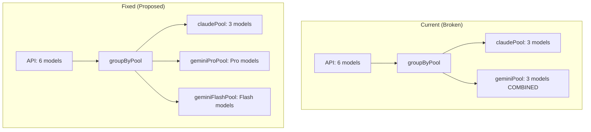

# Auto-Refresh System Investigation Report

**Created:** 2026-01-09
**Status:** Investigation Complete

---

## Executive Summary

Investigation of the auto-refresh system revealed **4 critical issues** that affect quota management accuracy and user experience:

1. **Quota Pool Mismatch** - 3 pools defined, only 2 tracked (BUG)
2. **Stale Timer Detection Missing** - No way to know if resetTime is actually ticking
3. **Visual Bug in TUI** - Shows incorrect countdown based on assumed elapsed time
4. **Pre-warming Logic Redundancy** - May be unnecessary with 5-minute checks

---

## Issue 1: Quota Pool Mismatch (CRITICAL)

### Problem

`quota-groups.ts` correctly defines **3 independent quota pools**:

```typescript
// src/cloudcode/quota-groups.ts:13-31
export type QuotaGroupKey = "claude" | "geminiPro" | "geminiFlash";

export const QUOTA_GROUPS = {
  claude: { models: ["claude-sonnet-4-5", "claude-opus-4-5-thinking", ...] },
  geminiPro: { models: ["gemini-3-pro-high", "gemini-3-pro-low", "gemini-2.5-pro"] },
  geminiFlash: { models: ["gemini-3-flash", "gemini-2.5-flash"] },
};
```

But `quota-api.ts` only tracks **2 pools**, combining Pro and Flash:

```typescript
// src/cloudcode/quota-api.ts:237-267
function groupByPool(quotas): { claudePool; geminiPool } {
  // BUG: All Gemini models go into single geminiPool
  const geminiAggregated = geminiModels.length > 0 ? Math.round(geminiModels.reduce((sum, m) => sum + m.percentage, 0) / geminiModels.length) : 0;
}
```

### Impact

- **Inaccurate quota display**: Pro and Flash quotas are averaged together
- **Incorrect reset time**: Uses earliest reset across ALL Gemini models
- **Broken scheduling**: refresh-priority/drain-highest modes can't prioritize correctly
- **Auto-refresh issues**: Tracks only 2 states instead of 3

### Affected Files

| File                                            | Issue                                                                                    |
| ----------------------------------------------- | ---------------------------------------------------------------------------------------- |
| `src/cloudcode/quota-api.ts`                    | `groupByPool()` returns 2 pools, should return 3                                         |
| `src/cloudcode/quota-api.ts:56-64`              | `AccountCapacity` type has `geminiPool`, should have `geminiProPool` + `geminiFlashPool` |
| `src/cloudcode/auto-refresh-scheduler.ts:22-31` | `AccountRefreshState` tracks 2 pools                                                     |
| `src/cloudcode/quota-storage.ts`                | `QuotaModelFamily = "claude" \| "gemini"` should include Pro/Flash                       |
| `src/tui/hooks/useCapacity.ts`                  | Uses combined `geminiPool`                                                               |
| `src/cli/capacity-renderer.ts`                  | Renders single "Gemini Pool"                                                             |

### Fix Required

1. Split `geminiPool` into `geminiProPool` and `geminiFlashPool`
2. Update all consumers to handle 3 pools
3. Use model names to classify: `gemini-*-pro-*` → Pro, `gemini-*-flash*` → Flash

---

## Issue 2: Stale Timer Detection Missing (HIGH)

### Problem

When the API returns `resetTime: "2026-01-09T15:30:00Z"` (4:59 remaining), we cannot tell if:

- **Timer IS ticking**: Started by first usage, will reset at that time
- **Timer is STALE**: From a PREVIOUS reset cycle, not actually active

### Visual Example

```
Check 1: resetTime = 4:59 remaining (at 3:00 PM)
Check 2: resetTime = 4:59 remaining (at 3:05 PM)  ← STALE! Should be 4:54

vs.

Check 1: resetTime = 4:59 remaining (at 3:00 PM)
Check 2: resetTime = 4:54 remaining (at 3:05 PM)  ← TICKING! Timer is active
```

### Root Cause

The API returns `resetTime` even after a quota reset completes. The value persists from the previous cycle until the next usage triggers a new timer.

### Current Code Vulnerability

```typescript
// src/cloudcode/auto-refresh-scheduler.ts:62-90
const claudeFresh = claudePct === 100;
// ...
if (anyFresh) {
  needsRefresh = true; // Triggers pre-warming
  reason = "Pre-warming: refreshing reset timer";
}
```

This correctly identifies 100% quota as needing refresh, but doesn't validate if the existing `resetTime` is actually stale.

### Detection Strategy

**Compare consecutive `resetTime` values:**

```typescript
interface TimerValidation {
  resetTime: string;
  fetchedAt: number; // When we fetched this value
}

function isTimerStale(current: TimerValidation, previous: TimerValidation): boolean {
  const expectedElapsed = current.fetchedAt - previous.fetchedAt;
  const currentMs = new Date(current.resetTime).getTime();
  const previousMs = new Date(previous.resetTime).getTime();
  const actualElapsed = previousMs - currentMs; // Should match expectedElapsed

  // If timer is ticking, it should decrease by ~expectedElapsed
  // Allow 30s tolerance for API latency
  return Math.abs(actualElapsed - expectedElapsed) > 30000;
}
```

### Fix Required

1. Store both `resetTime` and `fetchedAt` timestamp in `AccountRefreshState`
2. On each refresh, compare current vs previous values
3. If `resetTime` hasn't decreased as expected → timer is STALE
4. If stale and quota = 100% → trigger to start fresh timer

---

## Issue 3: Visual Bug in TUI (HIGH)

### Problem

The TUI calculates remaining time based on **local elapsed time**, not comparing consecutive API values.

### Scenario

```
T+0 (3:00 PM): Fetch quota → resetTime = 4:59:00
T+5 (3:05 PM): User refreshes TUI
  - TUI assumes: 5 minutes passed, so 4:59 - 5min = 4:54
  - Displays: "Resets in 4:54"
  - Reality: Timer is STALE, still 4:59 (or 5:00 if never started)
T+5 (3:05 PM): Fetch quota → resetTime = 4:59:00
  - TUI updates: "Resets in 4:59"
  - User sees: Time went BACKWARDS (4:54 → 4:59)
```

### Affected Code

```typescript
// src/cli/capacity-renderer.ts:194-199
export function formatResetTime(resetTime: string | null, options?: RenderOptions): string {
  if (!resetTime) {
    return options?.color ? pc.dim("none") : "none";
  }
  const timeUntil = getTimeUntil(resetTime); // Just calculates from current time
  // ...
}
```

The issue is that `getTimeUntil()` simply subtracts `Date.now()` from `resetTime`, which assumes the timer is always ticking.

### Fix Required

1. Store the `fetchedAt` timestamp with each `resetTime`
2. Display the **fetched** remaining time, not recalculated
3. Or: Only recalculate when we KNOW timer is ticking (via stale detection)
4. Add visual indicator when timer status is uncertain

---

## Issue 4: Pre-warming Logic Assessment (MEDIUM)

### Question

> "If the feature is to start a timer in the backend for 5 hours, is this even needed if there is a trigger every :05 or :00 checking all accounts?"

### Current Pre-warming Logic

```typescript
// src/cloudcode/auto-refresh-scheduler.ts:80-84
} else if (anyFresh) {
  // Priority 3: Pre-warm - at least one pool at 100% (stale timer)
  needsRefresh = true;
  reason = "Pre-warming: refreshing reset timer";
}
```

### Analysis

**With 10-minute checks (current):**

- Account at 100% → could wait up to 10 minutes before triggering
- Pre-warming ensures immediate trigger on first check

**With 5-minute clock-aligned checks (proposed):**

- Account at 100% → checked within 5 minutes maximum
- Pre-warming still valuable for:
  - Immediate startup trigger (no wait for next :00/:05)
  - Batch processing efficiency (all accounts in one pass)

### Recommendation

**Keep pre-warming, but simplify:**

1. Check interval: 5 minutes aligned to clock (:00, :05, :10, etc.)
2. Trigger accounts where:
   - Quota = 100% AND no valid resetTime (never used OR stale)
   - Quota = 0% AND no resetTime (exhausted, timer expired)
3. Skip accounts where:
   - Quota 1-99% (in use)
   - Quota = 0% AND has valid resetTime (waiting for reset)

---

## Issue 5: Model Selection for Triggering (ENHANCEMENT)

### Current Behavior

```typescript
// src/cloudcode/quota-reset-trigger.ts:162-163
// Use first model from each group (any model in the group starts the timer for all)
const modelId = quotaGroup.models[0];
```

Currently uses:

- Claude: `claude-sonnet-4-5` (first in array)
- Gemini Pro: `gemini-3-pro-high` (first in array)
- Gemini Flash: `gemini-3-flash` (first in array)

### User Request

> "Use specific models for reset: Opus for Claude, Gemini 3 Pro for Pro pool, Gemini 3 Flash for Flash pool"

### Recommended Fix

```typescript
const TRIGGER_MODELS: Record<QuotaGroupKey, string> = {
  claude: "claude-opus-4-5-thinking", // User preference
  geminiPro: "gemini-3-pro-high", // Already correct
  geminiFlash: "gemini-3-flash", // Already correct
};
```

---

## Summary of Required Changes

### Priority 1: Critical Fixes

| Issue         | File(s)                                                         | Change                                               |
| ------------- | --------------------------------------------------------------- | ---------------------------------------------------- |
| Pool mismatch | `quota-api.ts`, `quota-storage.ts`, `auto-refresh-scheduler.ts` | Split geminiPool → geminiProPool + geminiFlashPool   |
| Stale timer   | `auto-refresh-scheduler.ts`                                     | Add `fetchedAt` tracking, compare consecutive values |
| Visual bug    | `capacity-renderer.ts`, `useCapacity.ts`                        | Display fetched time, not recalculated               |

### Priority 2: Enhancements

| Issue                | File(s)                     | Change                                          |
| -------------------- | --------------------------- | ----------------------------------------------- |
| Clock-aligned checks | `auto-refresh-scheduler.ts` | Change to 5-minute intervals aligned to :00/:05 |
| Trigger models       | `quota-reset-trigger.ts`    | Use Opus for Claude pool                        |

---

## Data Flow Diagram



---

## Next Steps

1. **Update design document** `2026-01-09-account-scheduling-design.md` with:
   - 3-pool tracking requirement
   - Stale timer detection algorithm
   - Clock-aligned refresh interval

2. **Implementation order:**
   1. Fix quota pool mismatch (blocking for scheduling modes)
   2. Add stale timer detection (blocking for accurate display)
   3. Fix visual bug in TUI
   4. Implement scheduling modes
   5. Change to 5-minute clock-aligned checks
